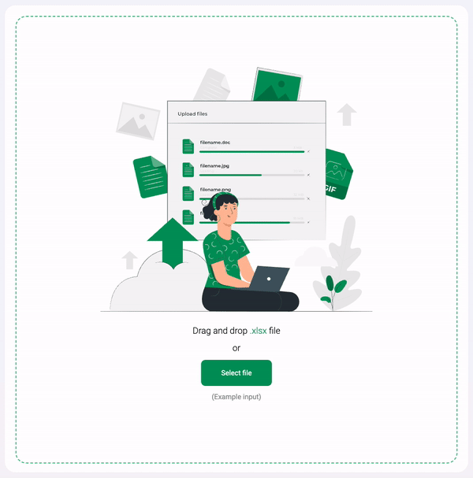

# Localizame

## What is Localizame?

Localizame is an opinionated open-source tool that generates Android, iOS, and Angular code, ready to be imported into your project, from a .xlsx template of internationalization (i18n) terms.

You can run Localizame locally as a web application using SvelteKit + Vite.

## Live Demo

Check out the fully functional demo of Localizame at [here](https://opensource.mercadona.com/localizame).

(We use a courtesy spot instance on GCP. If the demo is unresponsive, it means it's rebooting for a minute or two 😄)

## How it Works

Localizame is designed with a simple workflow. The input is an .xlsx file with a single sheet containing various columns. The first column contains string keys, and the subsequent columns contain translations for different languages, as many as you need.

### Step 1: Load the File

Drag and drop your .xlsx file into the designated area. You can find an example input file [here](./examples/example_input.xlsx).



### Step 2: Generate Code

Select the platforms you want to generate code for and click the "Download" button. You can find an example output file for Android and iOS [here](./examples/example_output.zip).


And **Voilà!** The downloaded .zip file contains the code that you need to add to your project to consume the translations.

## How to Run

To run Localízame, follow these steps:

```bash
npm install && npm run dev
```

## Feedback

We appreciate your feedback, ideas, and how you use Localizame. You can use the [issues](https://github.com/mercadonait/localizame/issues) section to communicate with us and the community.

## License, Expertise, and Contributions

Localizame is developed under the [Apache License](./LICENSE), which means you can contribute and help it grow. We would love to hear from you and have you on board!

[Learn how to contribute to Localízame](./CONTRIBUTING.md)

## Work with Us

If you're interested in this project and want to learn more about what we do, contact us at [Mercadona IT Opensource](mailto:opensource@mercadona.com).

If you'd like to work with us and contribute to our mission, apply [here](https://mercadona.avature.net/es_ES/Careers/SearchJobs/IT?3_60_3=243) to join Mercadona IT.
